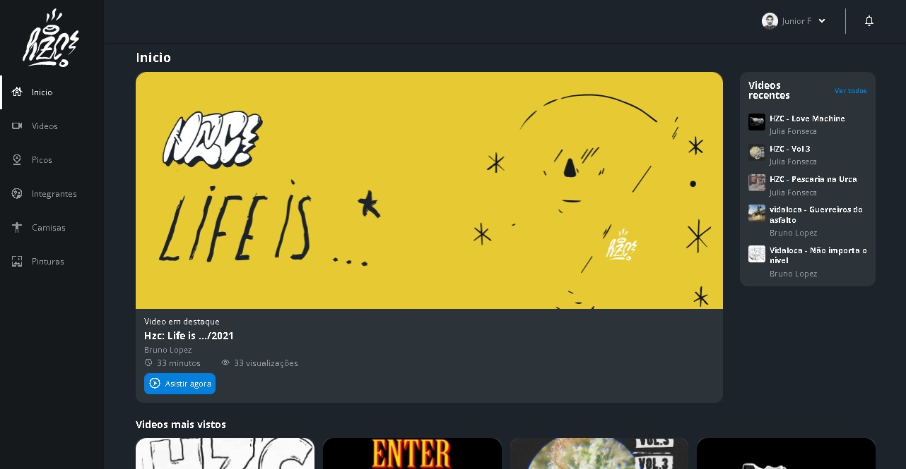

  

  

Este projeto tem como finalidade montar uma pagina de comunidade de skate. Utilizando o layout disponivel dentro do Figma

Algumas paginas serão montadas: home, picos e videos.

## Oque eu aprendi
<ul>
    <li>Flexbox e suas propriedades para o posicionamento de elementos</li>
    <li>Fazer o cabeçalho utilizando as ferramentas do flexbox</li>
    <li>Limitações do flexbox</li>
    <li>DIferenças entre flexbox do grid</li>
    <li>Criando cartões com propriedades básicas do grid</li>
    <li>Responsividade com grid</li>
</ul>

## Tecnologias utilizadas no projeto
* HTML
* CSS
* Javascript